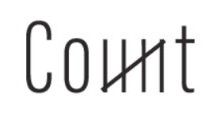

# Typescript-Starter

  
  

    
    
    
    
    
  

🧮 A CLI that counts words in your text file, because why not. 🧮

# Usage

**Automation:**

- Travis CI
- Code Coverage
- Automatic release and changelog (Please read the [Guide](./.github/GUIDE.md) on how to use it)

# Contribution

For future contributors please make sure to read the [Contributing Guide](./.github/GUIDE.md) before making a pull request.
# Credit

The logo is made by [Sahira Khader](https://dribbble.com/in_awe) and can be found [here](https://www.behance.net/gallery/78881117/Verbicons).
